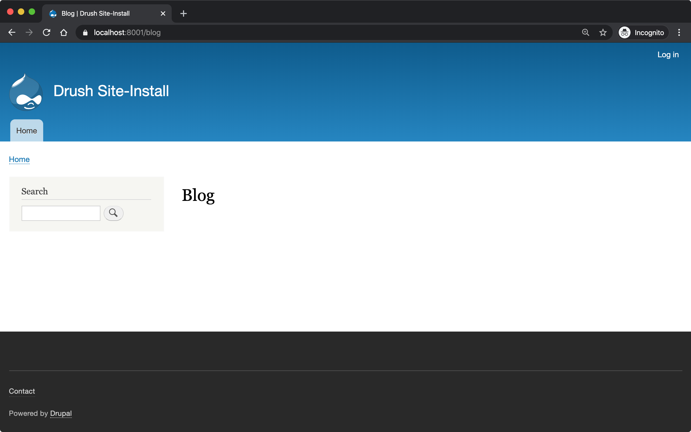
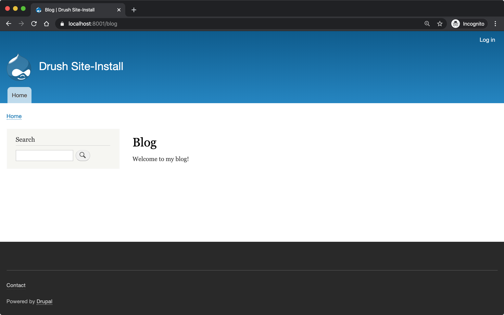
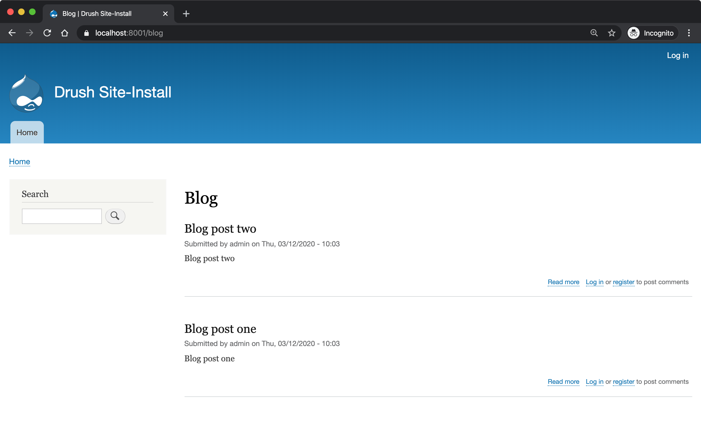

# Workshop: Automated Testing and Test Driven Development in Drupal 8

## Table of Contents

- [Introduction](#introduction)
- [Contribution](#contribution)
- [Feedback](#feedback)
- [Creating a new Drupal project with Composer](#creating-a-new-drupal-project-with-composer)
- [Using DDEV for local development](#using-ddev-for-local-development)
- [Using the PHP web server for local development](#using-the-php-web-server-for-local-development)
- [The different types of available tests](#the-different-types-of-available-tests)
- [Different approaches to testing](#different-approaches-to-testing)
- [The structure of a test](#the-structure-of-a-test)
- [What is Test Driven Development?](#what-is-test-driven-development)
- [Acceptance criteria](#acceptance-criteria)
- [Step 0: Preparation](#step-0-preparation)
- [Step 1: Writing your first test](#step-1-writing-your-first-test)
  - [1a. Create the module directory](#1a-create-the-module-directory)
  - [1b. Create an .info.yml file for the module](#1b-create-an-infoyml-file-for-the-module)
  - [1c. Create the directory structure for tests](#1c-create-the-directory-structure-for-tests)
  - [1d. Create your first test case](#1d-create-your-first-test-case)
  - [1e. Preparing PHPUnit](#1e-preparing-phpunit)
  - [1f. Running the tests](#1f-running-the-tests)
  - [1g. (Optional) Running tests via a Composer script](#1g-optional-running-tests-via-a-composer-script)
- [Step 2: Adding more test methods](#step-2-adding-more-test-methods)
  - [2a. Ensure that anonymous users cannot access admin pages](#2a-ensure-that-anonymous-users-cannot-access-admin-pages)
  - [2b. Ensure that administrators can access admin pages](#2b-ensure-that-administrators-can-access-admin-pages)
- [Step 3: Building a blog](#step-3-building-a-blog)
  - [3a. Anonymous users should be able to view the blog page](#3a-anonymous-users-should-be-able-to-view-the-blog-page)
  - [3b. Add a route for the blog page](#3b-add-a-route-for-the-blog-page)
  - [3c. Fix permission error](#3c-fix-permission-error)
  - [3d. Add the BlogPageController](#3d-add-the-blogpagecontroller)
  - [3e. Refactor, add more assertions](#3e-refactor-add-more-assertions)
- [Step 4: Getting blog posts](#step-4-getting-blog-posts)
  - [4a Creating our first kernel test](#4a-creating-our-first-kernel-test)
  - [4b. Starting with an assertion](#4b-starting-with-an-assertion)
  - [4c. Trying to use the ArticleRepository](#4c-trying-to-use-the-articlerepository)
  - [4d. Creating an article repository](#4d-creating-an-article-repository)
  - [4e. Adding the getAll() method](#4e-adding-the-getall-method)
  - [4f. Building up the ArticleRepository](#4f-building-up-the-articlerepository)
  - [4g. Adding articles](#4g-adding-articles)
  - [4h. Making this test less brittle](#4h-making-this-test-less-brittle)
  - [4i. Ensuring that only published articles are returned](#4i-ensuring-that-only-published-articles-are-returned)
  - [4j. Ensuring that articles are returned in the correct order](#4j-ensuring-that-articles-are-returned-in-the-correct-order)
  - [4k. Linking up the repository to the BlogPageController](#4k-linking-up-the-repository-to-the-blogpagecontroller)
- [Step 5: Wrapping up with unit tests](#step-5-wrapping-up-with-unit-tests)
  - [5a. Creating an ArticleWrapper](#5a-creating-an-articlewrapper)
  - [5b. Ensure that we’re only wrapping articles](#5b-ensure-that-were-only-wrapping-articles)
  - [5c. Determine if articles are publishable](#5c-determine-if-articles-are-publishable)

## Contribution

Please feel free to create issues and/or submit pull requests to this repository whilst working through these instructions. Any contributions would be greatly appreciated!

## Feedback

Feedback would also be appreciated! You can contact me via <oliver@odwd.uk>, [@opdavies on Twitter](https://twitter.com/opdavies) or `opdavies` on Drupal Slack.

## Introduction

## Creating a new Drupal project with Composer

If don’t have Composer, visit <https://getcomposer.org/download> for instructions on how to install it on your computer.

This assumes that Composer is installed globally and is available by running the `composer` command. Alternatively, you can download the phar file and run `php composer.phar` instead.

```bash
# Create a new Drupal project
composer create-project drupal/recommended-project my-project

cd my-project

# Add testing dependencies
composer require --dev drupal/core-dev
```

You should now have files present including `web/index.php` and `vendor/bin/phpunit`. Now you can start serving this site locally.

**Note:** Development dependencies, including PHPUnit, should only be installed locally and should not be present on public servers. Doing so would present a security risk to your application.

## Using DDEV for local development

- Docker based development environment for PHP applications (Drupal, WordPress, Magento etc).
- More information at <https://www.ddev.com>.
- Documentation at <https://ddev.readthedocs.io>.
- Installation via Homebrew on Linux and macOS, and Chocolatey on Windows. More information at <https://www.ddev.com/get-started>.
- Example at <https://github.com/opdavies/workshop-drupal-automated-testing-code>.

To run PHPUnit within DDEV, we can prefix the command with `ddev exec`:

```
$ ddev exec vendor/bin/phpunit
```

## Using the PHP web server for local development

If you have all of [Drupal's required PHP extensions](https://www.drupal.org/docs/system-requirements/php-requirements#extensions) installed and would like better performance (particularly on macOS), you could use the PHP's local web server.

As we're going to use SQLite to run the tests, there's no need for a connection to a MySQL database or another service.

If you need to override any environment variables, you can do so before running the command:

```
$ SIMPLETEST_BASE_URL=http://localhost:8000 vendor/bin/phpunit
```

## The different types of available tests

- **Functional** (web, feature) - tests behaviour and functionality, makes HTTP requests to the webserver and has access to the database and other services via the service container. Slower to run.
- **FunctionalJavascript** - functional tests, but access to JavaScript.
- **Kernel** (integration) - no browser capabilities, has access to the database and other services but requires more configuration.
- **Unit** - no access to the database or service container, all dependencies need to be mocked. Fast to run.

## Different approaches to testing

- Inside-out (testing pyramid) - mostly unit tests, some integration tests, few functional tests.
- Outside-in (testing trophy) - mostly functional tests, some integration tests, few unit tests. More flexible, easier to refactor.

## The structure of a test

- **Arrange** - set up the environment. Create users, nodes, set up dependencies
- **Act** - perform an action
- **Assert** - verify that something happened

## What is Test Driven Development?

- Writing tests first
- Red, green, refactor loop
  - Writing failing test first
  - Write code to make the test pass
  - Refactor when tests pass
- Three (simplified) rules of TDD:
  - Write production code only to make a failing unit test pass.
  - Write only enough of a unit test to fail.
  - Write only enough production code to make the failing unit test pass.
  - <http://www.javiersaldana.com/articles/tech/refactoring-the-three-laws-of-tdd>

## Acceptance criteria

This module will be used to demonstrate how to take a test-driven approach to develop a module to the following acceptance criteria:

- As a site visitor
- I want to see a list of all published articles at `/blog`
- Ordered by post date, with the newest posts first

## Step 0: Preparation

To begin with, we need the site to be running. If using the Symfony server, run these commands:

```bash
# Start the service containers
docker-compose up -d

# Start the local web server
symfony serve -d
```

You don’t need to install Drupal, it just needs to be able to connect to the database.

## Step 1: Writing your first test

### 1a. Create the module directory

Create a directory for the new module:

```
mkdir -p web/modules/custom/my_module
```

### 1b. Create an `.info.yml` file for the module

In order to install the module, it needs an info.yml file that matches the name of the module (e.g. `my_module.info.yml`).

Within the `my_module` directory, create the file and paste in the following content:

```yaml
name: My Module
type: module
core: 8.x
core_version_requirement: ^8 || ^9
package: Custom
```

### 1c. Create the directory structure for tests

```bash
mkdir -p tests/src/Functional
```

### 1d. Create your first test case

```php
// MyModuleTest.php

namespace Drupal\Tests\my_module\Functional;

use Drupal\Tests\BrowserTestBase;
use Symfony\Component\HttpFoundation\Response;

class MyModuleTest extends BrowserTestBase {

  protected $defaultTheme = 'stark';

  protected static $modules = ['my_module'];

   /** @test */
  public function the_front_page_loads_for_anonymous_users() {
    $this->drupalGet('<front>');

    $this->assertResponse(Response::HTTP_OK);
  }

}
```

Some things to note:

- The name of the class must match the filename.
- The filename must end with `Test.php`.
- The namespace is `Drupal\Tests\{module_name}`, followed by any additional directories (e.g. `Functional`).
- Test methods must start with `test`, or use the `@test` annotation.

### 1e. Preparing PHPUnit

Firstly, we need to create a `phpunit.xml` file to configure PHPUnit. Core has a `phpunit.xml.dist` file that we can duplicate and edit.

```bash
cp web/core/phpunit.xml.dist web/core/phpunit.xml
```

Update the `SIMPLETEST_BASE_URL` value to be the address that the website is currently running on. This needs to be correct so that functional tests return the correct response codes, so ensure that any port numbers are correct and also that the site is correctly marked as HTTP or HTTPS.

We also need to configure the database for Drupal to connect to and use when running functional and kernel tests. This could be your project’s MySQL or PostgreSQL database with a table prefix, but in this case, we’ll use a separate SQLite database.

```diff
- <env name="SIMPLETEST_BASE_URL" value=""/>
+ <env name="SIMPLETEST_BASE_URL" value="https://localhost:8000"/>

- <env name="SIMPLETEST_DB" value=""/>
+ <env name="SIMPLETEST_DB" value="sqlite://localhost//tmp/test.sqlite"/>
```

### 1f. Running the tests

```bash
# Make sure you’re in the right place
cd web

# Run the tests
../vendor/bin/phpunit -c core modules/custom/my_module
```

You should see a summary of the number of tests and assertions that were run. This is the expected output if all of the tests pass:

> OK (1 test, 2 assertions)

If a test failed, the output would show the class and method name for the failing test, and give a summary of the failure.

> Drupal\Tests\my_module\Functional\MyModuleTest::testThatTheFrontPageLoads
> Behat\Mink\Exception\ExpectationException: Current response status code is 404, but 200 expected.

Other useful options include `--stop-on-failure`, `--filter` and `--testdox`.

### 1g. (Optional) Running tests via a Composer script

To simplify running tests, the command could be simplified by [adding a script][composer scripts] to `composer.json`:

```json
"scripts": {
    "test:phpunit": "cd web && ../vendor/bin/phpunit -c core --verbose --testdox",
    "test": [
        "@test:phpunit"
    ]
}
```

This means that you can run just `symfony composer test:phpunit` or `symfony composer test` and it will automatically move into the right directory and execute the test command.

This approach can be useful if you want to run other commands in addition to PHPUnit such as PHPStan, PHP Code Sniffer or Drupal Check. Each command can be added to the script and they will each be executed.

If needed, you can still pass additional arguments and options to the command by appending `--` followed by the arguments.

```bash
symfony composer test:phpunit -- modules/custom/my_module \
  --stop-on-failure \
  --filter=the_front_page_loads_for_anonymous_users
```

Locally, make sure that the command is prefixed with `symfony` if you are using the Symfony web server to ensure that the correct PHP version etc is used.

[composer scripts]: https://getcomposer.org/doc/articles/scripts.md#writing-custom-commands

## Step 2: Adding more test methods

### 2a. Ensure that anonymous users cannot access admin pages

Now that we’re sure that the front page loads correctly, lets also check anonymous users cannot access the administration area. This test is very similar to the previous one, though instead we’re making a GET request to `/admin` and ensuring that the response code is 403 (forbidden).

As this functionality is provided by Drupal core by default, this should pass automatically.

```php
/** @test */
public function the_admin_page_is_not_accessible_to_anonymous_users() {
  $this->drupalGet('admin');

  $this->assertResponse(Response::HTTP_FORBIDDEN);
}
```

### 2b. Ensure that administrators can access admin pages

Now let’s check that an administrator user _can_ access the admin pages.

This introduces some new concepts. We need to create a user to begin with, and assign it some permissions. Because tests may be included within Drupal core a contributed module, permissions need to be added to users directly as modules won’t know about roles that are specific to your site.

The `BrowserTestBase` class gives access to a number of helper methods, including ones for creating and logging-in users (`createUser` and `drupalLogin` respectively). When creating a user, the first argument is an array of permission names to add. In this case, we can make the user an admin user by adding the `access administration pages` permission.

```php
/** @test */
public function the_admin_page_is_accessible_by_admin_users() {
  $adminUser = $this->createUser([
    'access administration pages',
  ]);

  $this->drupalLogin($adminUser);

  $this->drupalGet('admin');

  $this->assertResponse(Response::HTTP_OK);
}
```

Again, as this functionality is provided by Drupal core by default, this should pass. However, we can be confident that the test is doing what’s needed by making it fail by removing or changing the assigned permissions, or not logging in the user before accessing the page.

## Step 3: Building a blog

### 3a. Anonymous users should be able to view the blog page

Let’s start by building a blog page. This will look very similar to the admin page tests, but instead we’ll be testing the `/blog` page.

```php
// tests/src/Functional/BlogPageTest.php

namespace Drupal\my_module\Functional;

use Drupal\Tests\BrowserTestBase;
use Symfony\Component\HttpFoundation\Response;

class BlogPageTest extends BrowserTestBase {

  protected $defaultTheme = 'stark';

  protected static $modules = [
    'my_module',
  ];

  /** @test */
  public function the_blog_page_loads_for_anonymous_users_and_contains_the_right_text() {
    $this->drupalGet('blog');

    $session = $this->assertSession();

    $session->statusCodeEquals(Response::HTTP_OK);
  }

}
```

This test will fail as there’s no route for `/blog` and no View that generates that page. Because of this, the response code will be a 404 instead of the 200 that we want.

> Current response status code is 404, but 200 expected.

### 3b: Add a route for the blog page

We’ll create a blog page using a custom route in the module. You could also do this with the Views module by creating a View with a page on that path, and exporting the configuration into the module’s `config/install` directory.

To add a route, we need to create a `my_module.routing.yml` file.

```yaml
# my_module.routing.yml

blog.page:
  path: /blog
  defaults:
    _controller: Drupal\my_module\Controller\BlogPageController
    _title: Blog
  requirements:
    _permission: access content
```

We set our path to `/blog`, specify the Controller to use and which permission the needs to have to access the page.

If we run the tests now, we get an access denied error (403 response).

> Current response status code is 403, but 200 expected.

### 3c: Fix permission error

Because we need to node module to be able to access the `access content` permission, we need to enable it within our tests.

We can do this by adding it to the `$modules` array within the test.

```diff
  protected static $modules = [
+   'node',
    'my_module',
  ];
```

Now the error has changed, and is now returning a 500 response because we’ve specified a Controller that doesn’t exist.

> Current response status code is 500, but 200 expected.

### 3d: Add the BlogPageController

Let’s create the `BlogPageController`.

```
mkdir src/Controller
```

Let’s start by creating a minimal controller, that returns an empty render array. Because we didn’t specify a method to use within the route file, we use PHP’s `__invoke()` method.

```php
// src/Controller/BlogPageController

namespace Drupal\my_module\Controller;

class BlogPageController {

  public function __invoke(): array {
    return [];
  }

}
```

This is enough for the test to pass. Though it just returns an empty page, it now returns the correct 200 response code.

> OK (1 test, 3 assertions)

This is how the page looks in a browser:



### 3e: Refactor, add more assertions

Now that the test is passing, we can do some refactoring and make the test more robust by ensuring that the correct text is displayed.

```diff
 public function the_blog_page_loads_for_anonymous_users_and_contains_the_right_text() {
    $this->drupalGet('/blog');

    $session = $this->assertSession();

    $session->statusCodeEquals(Response::HTTP_OK);
+   $session->responseContains('<h1>Blog</h1>');
+   $session->pageTextContains('Welcome to my blog!');
  }
```

The page title is created by the `_title` value within the routing file, but no page text has been added yet so this will cause the test to fail.

> Behat\Mink\Exception\ResponseTextException: The text "Welcome to my blog!" was not found anywhere in the text of the current page.

To fix this, we can return some text from the BlogPageController rather than an empty render array.

```diff
  namespace Drupal\my_module\Controller;

+ use Drupal\Core\StringTranslation\StringTranslationTrait;

  class BlogPageController {

+   use StringTranslationTrait;

    public function __invoke(): array {
-     return [];
+     return [
+       '#markup' => $this->t('Welcome to my blog!'),
+     ];
    }

  }
```

Now the tests will pass because we’re returning the correct text.

> OK (1 test, 3 assertions)



## Step 4. Getting blog posts

### 4a Creating our first kernel test

We’ll be using an ArticleRepository class to get the blog posts from the database, and this is also a good time to switch to writing kernel tests as we don’t need to check any responses from the browser.

Within the tests directory, create a new `Kernel` directory.

```
mkdir tests/src/Kernel
```

And an `ArticleRepositoryTest` class.

```php
// tests/src/Kernel/ArticleRepositoryTest.php

namespace Drupal\Tests\my_module\Kernel;

use Drupal\KernelTests\Core\Entity\EntityKernelTestBase;

class ArticleRepositoryTest extends EntityKernelTestBase {

  /** @test */
  public function nodes_that_are_not_articles_are_not_returned() {

  }

}
```

This test looks very similar to the functional ones that we’ve already written, except it extends a different base class.

This test is extending `EntityKernelTestBase` as we’re working with entities and this performs some useful setup steps for us. There are different base classes that can be used though based on what you need - including `KernelTestBase` and `ConfigFormTestBase`.

### 4b. Starting with an assertion

Let’s write this test 'backwards' and start with the 'assert' phase.

We know that the end objective for this test is to have 3 article nodes returned, so let’s add that assertion first.

```diff
  /** @test */
  public function nodes_that_are_not_articles_are_not_returned() {
+    $this->assertCount(3, $articles);
  }
```

As we aren’t yet returning any articles, or even creating that variable, the test is going to fail, but we can move on to getting articles.

> Undefined variable: articles

### 4c. Trying to use the ArticleRepository

As the test name suggests, we’re going to be retrieving the articles from an `ArticleRepository` service - though this doesn’t exist yet, but let’s let the tests tell us that.

```diff
  /** @test */
  public function nodes_that_are_not_articles_are_not_returned() {
+   $repository = $this->container->get(ArticleRepository::class);
+
    $this->assertCount(3, $articles);
  }
```

Because this is a kernel test, we have access to the container, and we can use it to retrieve our repository service.

Running the test now gives us a different error, and tells us what the next step is:

> Symfony\Component\DependencyInjection\Exception\ServiceNotFoundException : You have requested a non-existent service "Drupal\Tests\my_module\Kernel\ArticleRepository".

### 4d. Creating an article repository

```bash
mkdir src/Repository
```

To begin with, let’s create a basic `ArticleRepository` class.

```php
// my_module/src/Repository/ArticleRepository

namespace Drupal\my_module\Repository;

class ArticleRepository {

}
```

We also need to create a `my_module.services.yml` file that we can use to register the `ArticleRepository` as a service.

```yaml
# my_module.services.yml

services:
  Drupal\my_module\Repository\ArticleRepository: ~
```

Within `ArticleRepositoryTest`, we need to add the import statement for the `ArticleRepository` as well enabling the module.

```diff
+ use Drupal\my_module\Repository\ArticleRepository;

+ public static $modules = [
+   'my_module',
+ ];
```

We’ve fixed the missing repository, though we still haven’t created the `$articles` variable or given it a value yet.

> Undefined variable: articles

### 4e. Adding the `getAll()` method

We’ll use a `getAll()` method on the repository to retrieve the articles from the database, and use the value of this for the `$articles` variable:

```diff
  $repository = $this->container->get(ArticleRepository::class);
+ $articles = $repository->getAll();

  $this->assertCount(3, $articles);
```

This method doesn’t exist on the repository yet, so the test will fail.

> Error : Call to undefined method
> Drupal\my_module\Repository\ArticleRepository::getAll()

Let’s fix that by adding the `getAll()` method. For now, have it return an empty array.

```php
// my_module/Repository/ArticleRepository.php

public function getAll(): array {
  return [];
}
```

Now we’ve got everything in place, and the test failure is because we aren’t returning the correct number of articles.

> Failed asserting that actual size 0 matches expected size 3.

We can fix this by building up the `ArticleRepository` class.

### 4f. Building up the ArticleRepository

The `ArticleRepository` needs to return some articles. We can do this by injecting the `EntityTypeManager` and using it to return nodes from the `getAll()` method rather than the empty array.

```diff
+ use Drupal\Core\Entity\EntityTypeManagerInterface;
+
+ /**
+  * @var \Drupal\Core\Entity\EntityStorageInterface
+  */
+ private $nodeStorage;

+ public function __construct(EntityTypeManagerInterface $entityTypeManager) {
+   $this->nodeStorage = $entityTypeManager->getStorage('node');
+ }

  public function getAll(): array {
-   return [];
+   return $this->nodeStorage->loadMultiple();
  }
```

Within our services file, we now need to add the `EntityTypeManager` as an argument so that it’s used to create the `ArticleRepository`. Currently we don’t have enough arguments.

> ArgumentCountError : Too few arguments to function Drupal\my_module\Repository\ArticleRepository::\_\_construct(), 0 passed and exactly 1 expected

The quickest way to do that is to enable autowiring for the ArticleRepository within `my_module.services.yml`. This will automatically inject services rather than needing to specify each argument individually.

```diff
- Drupal\my_module\Repository\ArticleRepository: ~
+ Drupal\Core\Entity\EntityTypeManagerInterface:
+   alias: entity_type.manager
+
+ Drupal\my_module\Repository\ArticleRepository:
+   autowire: true
```

> Drupal\Component\Plugin\Exception\PluginNotFoundException : The "node" entity type does not exist.

As we did previously, we need to enable the `node` module.

```diff
  public static $modules = [
+  'node',
   'my_module',
  ];
```

The `ArticleRepository` is now working, but is still returning no articles - though this is because we haven’t created any inside the test.

> Failed asserting that actual size 0 matches expected size 3.

### 4g. Adding articles

To test the ArticleRepository, we need articles to be created so that they can be returned.

Within the `ArticleRepositoryTest` we can make use of one of a number of traits that are provided.

Within the class, enable the trait:

```diff
+ use NodeCreationTrait
```

Include the import statement at the top of the file if it hasn’t been added automatically.

```diff
+ use Drupal\Tests\node\Traits\NodeCreationTrait;
```

This gives us a `createNode` method that we can use to create nodes by passing an array of values.

As we need 3 articles, let’s create them.

```diff
+ $this->createNode(['type' => 'article'])->save();
+ $this->createNode(['type' => 'article'])->save();
+ $this->createNode(['type' => 'article'])->save();

  $repository = $this->container->get(ArticleRepository::class);
  $articles = $repository->getAll();
```

The next error is a little cryptic:

> Error : Call to a member function id() on bool

Looking at the stack trace, this error is within `filter.module`, where it’s trying to call an `id()` method on a filter format.

```php
// filter.module

$formats = filter_formats($account);
$format = reset($formats);
return $format->id();
```

As kernel tests don’t install configuration by default, we need to install the missing filter configuration.

As we’ll need this for all test methods in this case, we can use the `setUp()` method that will run before each test.

```diff
+ protected function setUp() {
+   parent::setUp();
+
+   $this->installConfig([
+     'filter',
+   ]);
+ }
```

We also need to create the `node_access` table as indicated by the next error:

> Drupal\Core\Entity\EntityStorageException : SQLSTATE[HY000]: General error: 1 no such table: test90927710.node_access: DELETE FROM {node_access}

```diff
  protected function setUp() {
    parent::setUp();
+
+   $this->installSchema('node', ['node_access']);
+
    $this->installConfig([
      'filter',
    ]);
  }
```

We’ve successfully returned our three articles and this test now passes.

> OK (1 test, 6 assertions)

### 4h. Making this test less brittle

The test is passing, but it currently returns _all_ nodes and not just articles.

If we create some page nodes too, these will also be returned and the assertion will now fail.

```diff
  $this->createNode(['type' => 'article'])->save();
+ $this->createNode(['type' => 'page'])->save();
  $this->createNode(['type' => 'article'])->save();
+ $this->createNode(['type' => 'page'])->save();
  $this->createNode(['type' => 'article'])->save();
```

> Failed asserting that actual size 5 matches expected size 3.

We can make a change to the `ArticleRepository` to fix this, and ensure that we’re only loading and returning article nodes.

```diff
- return $this->nodeStorage->loadMultiple();
+ return $this->nodeStorage->loadByProperties([
+   'type' => 'article',
+ ]);
```

### 4i. Ensuring that only published articles are returned

We now know that only article nodes are returned, but _all_ articles are being returned. On our blog, we only want to published articles to be displayed.

Let’s create another test for this.

```diff
+ /** @test */
+ public function only_published_articles_are_returned() {
+   $repository = $this->container->get(ArticleRepository::class);
+   $articles = $repository->getAll();

+   $this->assertCount(3, $articles);
+ }
```

We already know that only articles are returned, so in this test we can focus on the published status. We can create a number of articles, some which are published and some which are unpublished.

```diff
  /** @test */
  public function only_published_articles_are_returned() {
+   $this->createNode(['type' => 'article', 'status' => Node::PUBLISHED])->save();
+   $this->createNode(['type' => 'article', 'status' => Node::NOT_PUBLISHED])->save();
+   $this->createNode(['type' => 'article', 'status' => Node::PUBLISHED])->save();
+   $this->createNode(['type' => 'article', 'status' => Node::NOT_PUBLISHED])->save();
+   $this->createNode(['type' => 'article', 'status' => Node::PUBLISHED])->save();

    $repository = $this->container->get(ArticleRepository::class);
    $articles = $repository->getAll();

    $this->assertCount(3, $articles);
  }
```

Because we have no filter on the published state, all the articles are returned including the unpublished ones.

> Failed asserting that actual size 5 matches expected size 3.

We can again update the `ArticleRepository` to add this extra condition to filter out any unpublished articles.

```diff
+ use Drupal\node\Entity\Node;

 public function getAll(): array {
   return $this->nodeStorage->loadByProperties([
+    'status' => Node::PUBLISHED,
     'type' => 'article',
   ]);
 }
```

With this added, the test passes again.

> OK (1 test, 6 assertions)

### 4j. Ensuring that articles are returned in the correct order

As per our acceptance criteria, we need the articles to be returned based on their created date, so let’s create another test.

In this test, let’s ensure assert that some article node IDs are returned within a specific order.

```diff
+ /** @test */
+ public function nodes_are_ordered_by_date_and_newest_first() {
+   $this->assertSame([3, 1, 2, 5, 4], $nodeIds);
+ }
```

We can use the same `getAll()` method, and get the node IDs from the array keys.

```diff
  /** @test */
  public function nodes_are_ordered_by_date_and_returned_newest_first() {
+   $repository = $this->container->get(ArticleRepository::class);
+   $nodes = $repository->getAll();
+   $nodeIds = array_keys($nodes);

    $this->assertSame([3, 1, 2, 5, 4], $nodeIds);
  }
```

Use `createNode()` again to create some article nodes, each with a different `created` date to match our assertion. This is to ensure that the test doesn’t pass by default.

```diff
  /** @test */
  public function nodes_are_ordered_by_date_and_returned_newest_first() {
+   $this->createNode(['type' => 'article', 'created' => (new DrupalDateTime('-2 days'))->getTimestamp()]);
+   $this->createNode(['type' => 'article', 'created' => (new DrupalDateTime('-1 week'))->getTimestamp()]);
+   $this->createNode(['type' => 'article', 'created' => (new DrupalDateTime('-1 hour'))->getTimestamp()]);
+   $this->createNode(['type' => 'article', 'created' => (new DrupalDateTime('-1 year'))->getTimestamp()]);
+   $this->createNode(['type' => 'article', 'created' => (new DrupalDateTime('-1 month'))->getTimestamp()]);

    $repository = $this->container->get(ArticleRepository::class);
    $nodes = $repository->getAll();
    $nodeIds = array_keys($nodes);

    $this->assertSame([3, 1, 2, 5, 4], $nodeIds);
  }
```

This test fails as expected, as the nodes are returned in their default order, by node ID.

> Failed asserting that two arrays are identical. --- Expected +++ Actual @@ @@
> Array &0 (
>
> - 0 => 3
> - 1 => 1
> - 2 => 2
> - 3 => 5
> - 4 => 4
>
> * 0 => 1
> * 1 => 2
> * 2 => 3
> * 3 => 4
> * 4 => 5 )

To order the articles by their created date, we can update the `getAll()` method within the `ArticleRepository`.

```diff
  public function getAll(): array {
-   return $this->nodeStorage->loadByProperties([
+   $articles = $this->nodeStorage->loadByProperties([
      'status' => Node::PUBLISHED,
      'type' => 'article',
    ]);
+
+   $this->sortByCreatedDate($articles);
+
+   return $articles;
+ }
+
+ private function sortByCreatedDate(array &$articles): void {
+   uasort($articles, function (NodeInterface $a, NodeInterface $b): bool {
+     return $a->getCreatedTime() < $b->getCreatedTime();
+   });
  }
```

The nodes are now ordered by their created date, and in the correct order to match the assertion.

> OK (1 test, 6 assertions)

### 4k. Linking up the repository to the BlogPageController

Now that our `ArticleRepository` tests are passing, we can use it within `BlogPageController` so that articles are displayed on the page.

Let’s add `BlogPageController` as a service and enable autowiring.

```diff
  # my_module.services.yml

  services:
+   Drupal\my_module\Controller\BlogPageController:
+     autowire: true

    Drupal\my_module\Repository\ArticleRepository:
      autowire: true
```

Now we can inject the `ArticleRepository` and use it to load and render the articles on the page.

```diff

namespace Drupal\my_module\Controller;

use Drupal\Core\Entity\EntityTypeManagerInterface;
use Drupal\Core\StringTranslation\StringTranslationTrait;
use Drupal\my_module\Repository\ArticleRepository;

class BlogPageController {

  use StringTranslationTrait;

+ /**
+  * @var \Drupal\my_module\Repository\ArticleRepository
+  */
+ private $articleRepository;
+
+ /**
+  * @var \Drupal\Core\Entity\EntityViewBuilderInterface
+  */
+ private $nodeViewBuilder;
+
+ public function __construct(
+   EntityTypeManagerInterface $entityTypeManager,
+   ArticleRepository $articleRepository
+ ) {
+   $this->nodeViewBuilder = $entityTypeManager->getViewBuilder('node');
+   $this->articleRepository = $articleRepository;
+ }

  public function __invoke(): array {
-   return [];
+   $build = [];
+
+   $articles = $this->articleRepository->getAll();

+   foreach ($articles as $article) {
+     $build[] = $this->nodeViewBuilder->view($article, 'teaser');
+   }
+
+   return [
+     '#markup' => render($build),
+   ];
  }

}
```

In the browser, we should see our list of articles.



## Step 5: Wrapping up with unit tests

### 5a: Creating an ArticleWrapper

The final thing that we’re going to do is create a wrapper class for articles so that we can add additional methods.

```bash
mkdir -p tests/src/Unit/Wrapper
```

```php
// tests/src/Unit/Wrapper/ArticleWrapperTest

namespace Drupal\Tests\my_module\Unit\Wrapper;

use Drupal\Tests\UnitTestCase;

class ArticleWrapperTest extends UnitTestCase {
}
```

The first thing that we’re going to check is that we can wrap an article node and then retrieve it again.

```php
/** @test */
public function it_can_return_the_article() {
  $articleWrapper = new ArticleWrapper($article);

  $this->assertInstanceOf(NodeInterface::class, $articleWrapper->getOriginal());
  $this->assertSame(5, $articleWrapper->getOriginal()->id());
  $this->assertSame('article', $articleWrapper->getOriginal()->bundle());
}
```

Lets create the `ArticleWrapper`:

```php
// src/Wrapper/ArticleWrapper

namespace Drupal\my_module\Wrapper;

use Drupal\node\NodeInterface;

class ArticleWrapper {

  private $article;

  public function __construct(NodeInterface $node) {
    $this->article = $node;
  }

  public function getOriginal(): NodeInterface {
    return $this->article;
  }

}
```

In the `ArticleWrapperTest`, add the import statement for the wrapper.

```diff
+ use Drupal\my_module\Wrapper\ArticleWrapper;
  use Drupal\Tests\UnitTestCase;
```

Currently, we don’t yet have an article to wrap.

> Undefined variable: article

Because this is a unit test which has no access to the database, we can’t use the `createNode()` method or `Node::create()` so we need to create a mock node.

```diff
+ use Drupal\node\NodeInterface;

$article = $this->createMock(NodeInterface::class);
```

This satisfies the instance assertion, but the other assertions are failing.

> Failed asserting that null is identical to 5.

In order for this to pass, we need to specify what value each method will method will return (e.g. which node ID and which bundle type) so that these values are populated when used within the production code.

```diff
  $article = $this->createMock(NodeInterface::class);
+ $article->method('id')->willReturn(5);
+ $article->method('bundle')->willReturn('article');
```

> OK (1 test, 3 assertions)

### 5b. Ensure that we’re only wrapping articles

The ArticleWrapper is only supposed to be used for wrapping articles, so we want to throw an Exception if a different type of node is used.

Let’s create a page node and assert that an Exception should be thrown.

```php
/** @test */
public function it_throws_an_exception_if_the_node_is_not_an_article() {
  $this->expectException(\InvalidArgumentException::class);

  $page = $this->createMock(NodeInterface::class);
  $page->method('bundle')->willReturn('page');

  new ArticleWrapper($page);
}
```

Because we’re currently not throwing an Exception, the assertion fails.

> Failed asserting that exception of type "InvalidArgumentException" is thrown.

Within `ArticleWrapper`, add a check using the `bundle()` method and throw an Exception if it is not an article.

```diff
  public function __construct(NodeInterface $node) {
+   $this->verifyNodeType($node);

    $this->article = $node;
  }

+ private function verifyNodeType(NodeInterface $node): void {
+  if ($node->bundle() != 'article') {
+    throw new \InvalidArgumentException(sprintf(
+      '%s is not an article',
+      $node->bundle()
+    ));
+   }
+ }
```

If the Exception is thrown, the test will pass.

### 5c. Determine if articles are publishable

Let’s imagine that there is a rule that articles less than 3 days old are not eligible to be published and we want to add an `isPublishable()` method that will contain this logic and determine whether or not an article is publishable.

We need access to the `Time` class to get the system time, so this is added as an argument to the constructor and used within `isPublishable()` to compare the created time of the article to the current time.

```diff
+ use Drupal\Component\Datetime\TimeInterface;
  use Drupal\node\NodeInterface;

  class ArticleWrapper {

    private $article;

-   public function __construct(NodeInterface $node) {
+   public function __construct(TimeInterface $time, NodeInterface $node) {
      $this->verifyNodeType($node);

+     $this->time = $time;
      $this->article = $node;
    }

+   public function isPublishable(): bool {
+     $created = $this->article->getCreatedTime();
+
+    $difference = $this->time->getRequestTime() - $created;
+
+    return $difference >= 60 * 60 * 24 * 3;
+  }

  }
```

We want to compare against a number of dates to ensure that this is working as expected. Rather than writing separate tests, we can use a data provider. This is a method that returns data to be passed to the tests as parameters.

```php
public function articleCreatedDateProvider() {
  return [
    ['-1 day', FALSE],
    ['-2 days 59 minutes', FALSE],
    ['-3 days', TRUE],
    ['-1 week', TRUE],
  ];
}
```

Use the `@dataProvider` annotation for the test to specify the method to use, and add the parameters to the test.

We also need to create a mock for `TimeInterface` so that it can be passed into the article wrapper, and so that methods on it can return certain values.

```php
/**
 * @test
 * @dataProvider articleCreatedDateProvider
 */
public function articles_created_less_than_3_days_ago_are_not_publishable(
  string $offset,
  bool $expected
) {
  $time = $this->createMock(TimeInterface::class);

  $time->method('getRequestTime')->willReturn(
    (new \DateTime())->getTimestamp()
  );

  $article = $this->createMock(NodeInterface::class);
  $article->method('bundle')->willReturn('article');

  $article->method('getCreatedTime')->willReturn(
    (new \DateTime())->modify($offset)->getTimestamp()
  );

  $articleWrapper = new ArticleWrapper($time, $article);

  $this->assertSame($expected, $articleWrapper->isPublishable());
}
```

We can use `$offset` value to modify the returned date from `getCreatedTime()`, and use `$expected` to make the assertion against `isPublishable()`.

The test is run, is then run against each set of data and passes or fails accordingly.

> - Articles created less than 3 days ago are not publishable with data set #0 [23.76 ms]
> - Articles created less than 3 days ago are not publishable with data set #1 [0.32 ms]
> - Articles created less than 3 days ago are not publishable with data set #2 [0.25 ms]
> - Articles created less than 3 days ago are not publishable with data set #3 [0.37 ms]

The other tests will also need to be updated to mock `TimeInterface` and pass it to the article wrapper.

## 5d: Refactoring the unit tests

With the unit tests passing, we can refactor them and simplify things by extracting a method for creating an article wrapper.

As each test will need the mocked time, this can be moved into a `setUp` method, and we can use `$this->time` instead within the test.

```php
private $time;

protected function setUp() {
  parent::setUp();

  $this->time = $this->createMock(Time::class);
}
```

```diff
- $time->method('getRequestTime')->willReturn(
+ $this->time->method('getRequestTime')->willReturn(
    (new \DateTime())->getTimestamp()
  );
```

To make it simpler to create an article wrapper, we can create a helper method for that. This will also be responsible for creating and injecting any dependencies.

```php
private function createArticleWrapper(NodeInterface $article): ArticleWrapper {
  return new ArticleWrapper($this->time, $article);
}
```

Now we can update the tests to use the new `createArticleWrapper()` method:

```diff
- $time = $this->createMock(TimeInterface::class);
- $articleWrapper = new ArticleWrapper($time, $article);
+ $articleWrapper = $this->createArticleWrapper($article);

- $time = $this->createMock(TimeInterface::class);
- new ArticleWrapper($time, $page);
+ $articleWrapper = $this->createArticleWrapper($page);

- $articleWrapper = new ArticleWrapper($time, $article);
+ $articleWrapper = $this->createArticleWrapper($article);
```

If the refactor was successful, the tests will still pass.
