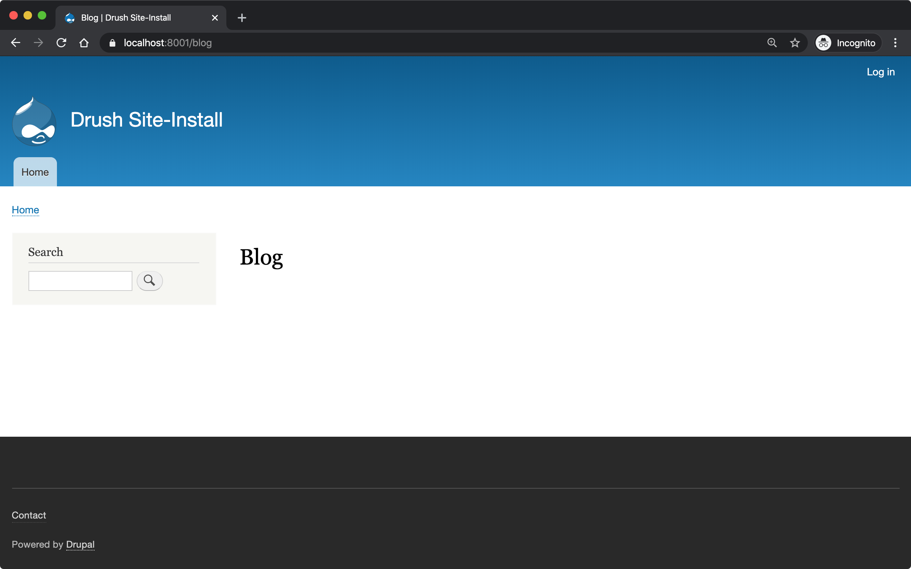
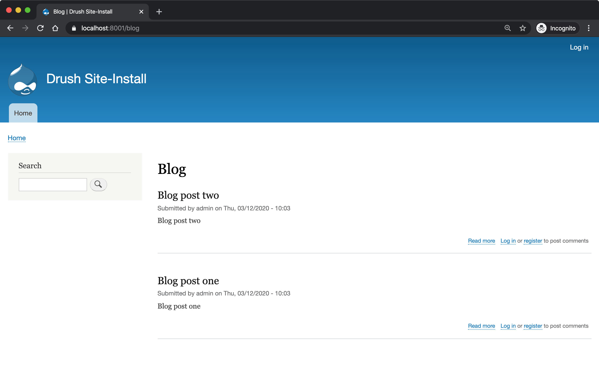

Workshop: Automated Testing and Test Driven Development in Drupal 8
===================================================================

.. sectnum::

.. contents::

Contribution
------------

Please feel free to create issues and/or submit pull requests to this
repository whilst working through these instructions. Any contributions
would be greatly appreciated!

Feedback
--------

Feedback would also be appreciated! You can contact me via oliver@odwd.uk, [@opdavies on Twitter](https://twitter.com/opdavies) or ``opdavies`` on Drupal Slack.

Introduction
------------

Creating a new Drupal project with Composer
-------------------------------------------

If don’t have Composer, visit https://getcomposer.org/download for instructions on how to install it on your computer.

This assumes that Composer is installed globally and is available by running the ``composer`` command. Alternatively, you can download the phar file and run ``php composer.phar`` instead.

.. code:: bash

    # Create a new Drupal project
    composer create-project drupal/recommended-project my-project

    cd my-project

    # Add testing dependencies
    composer require --dev drupal/core-dev

You should now have files present including ``web/index.php`` and ``vendor/bin/phpunit``. Now you can start serving this site locally.

**Note:** Development dependencies, including PHPUnit, should only be
installed locally and should not be present on public servers. Doing so
would present a security risk to your application.

Using DDEV for local development
--------------------------------

-  Docker based development environment for PHP applications (Drupal,
   WordPress, Magento etc).
-  More information at https://www.ddev.com.
-  Documentation at https://ddev.readthedocs.io.
-  Installation via Homebrew on Linux and macOS, and Chocolatey on
   Windows. More information at https://www.ddev.com/get-started.
-  Example at
   https://github.com/opdavies/workshop-drupal-automated-testing-code.

To run PHPUnit within DDEV, we can prefix the command with
``ddev exec``:

::

    $ ddev exec vendor/bin/phpunit

Using the PHP web server for local development
----------------------------------------------

If you have all of `Drupal's required PHP
extensions <https://www.drupal.org/docs/system-requirements/php-requirements#extensions>`__
installed and would like better performance (particularly on macOS), you
could use the PHP's local web server.

As we're going to use SQLite to run the tests, there's no need for a
connection to a MySQL database or another service.

If you need to override any environment variables, you can do so before
running the command:

::

    $ SIMPLETEST_BASE_URL=http://localhost:8000 vendor/bin/phpunit

The different types of available tests
--------------------------------------

-  **Functional** (web, feature) - tests behaviour and functionality,
   makes HTTP requests to the webserver and has access to the database
   and other services via the service container. Slower to run.
-  **FunctionalJavascript** - functional tests, but access to
   JavaScript.
-  **Kernel** (integration) - no browser capabilities, has access to the
   database and other services but requires more configuration.
-  **Unit** - no access to the database or service container, all
   dependencies need to be mocked. Fast to run.

Different approaches to testing
-------------------------------

-  Inside-out (testing pyramid) - mostly unit tests, some integration
   tests, few functional tests.
-  Outside-in (testing trophy) - mostly functional tests, some
   integration tests, few unit tests. More flexible, easier to refactor.

The structure of a test
-----------------------

-  **Arrange** - set up the environment. Create users, nodes, set up
   dependencies
-  **Act** - perform an action
-  **Assert** - verify that something happened

What is Test Driven Development?
--------------------------------

-  Writing tests first
-  Red, green, refactor loop
-  Writing failing test first
-  Write code to make the test pass
-  Refactor when tests pass
-  Three (simplified) rules of TDD:
-  Write production code only to make a failing unit test pass.
-  Write only enough of a unit test to fail.
-  Write only enough production code to make the failing unit test pass.
-  http://www.javiersaldana.com/articles/tech/refactoring-the-three-laws-of-tdd

Acceptance criteria
-------------------

This module will be used to demonstrate how to take a test-driven
approach to develop a module to the following acceptance criteria:

-  As a site visitor
-  I want to see a list of all published articles at ``/blog``
-  Ordered by post date, with the newest posts first

Preparation
-----------

To begin, we need the site to be running.

.. code:: bash

    # Using DDEV
    ddev start

    # Using PHP's web server
    php -S localhost:8000 -t web

You don’t need to install Drupal. It just needs to be able to connect to
the database.

Writing your first test
-----------------------

Create the module directory
~~~~~~~~~~~~~~~~~~~~~~~~~~~

Create a directory for the new module:

::

    mkdir -p web/modules/custom/my_module

1b. Create an ``.info.yml`` file for the module
~~~~~~~~~~~~~~~~~~~~~~~~~~~~~~~~~~~~~~~~~~~~~~~

In order to install the module, it needs an info.yml file that matches the name of the module (e.g. ``my_module.info.yml``).

Within the ``my_module`` directory, create the file and paste in the following content:

.. code:: yaml

    name: My Module
    type: module
    core_version_requirement: ^8 || ^9

Create the directory structure for tests
~~~~~~~~~~~~~~~~~~~~~~~~~~~~~~~~~~~~~~~~

.. code:: bash

    mkdir -p tests/src/Functional

Create your first test case
~~~~~~~~~~~~~~~~~~~~~~~~~~~

.. code:: php

    <?php

    namespace Drupal\Tests\my_module\Functional;

    use Drupal\Tests\BrowserTestBase;
    use Symfony\Component\HttpFoundation\Response;

    class FrontPageTest extends BrowserTestBase {

      protected static $modules = ['node', 'views'];

      /** @test */
      public function the_front_page_loads_for_anonymous_users() {
        $this->config('system.site')
          ->set('page.front', '/node')
          ->save(TRUE);

        $this->drupalGet('<front>');

        $assert = $this->assertSession();
        $assert->statusCodeEquals(Response::HTTP_OK);
        $assert->pageTextContains('Welcome to Drupal');
        $assert->pageTextContains('No front page content has been created yet.');
      }

    }

Some things to note:

-  The name of the class must match the filename.
-  The filename must end with ``Test.php``.
-  The namespace is ``Drupal\Tests\{module_name}``, followed by any additional directories (e.g. ``Functional``).
-  Test methods must start with ``test``, or use the ``@test`` annotation.

Preparing PHPUnit
~~~~~~~~~~~~~~~~~

Firstly, we need to create a ``phpunit.xml`` file to configure PHPUnit. Core has a ``phpunit.xml.dist`` file that we can duplicate and edit.

.. code:: bash

    cp web/core/phpunit.xml.dist web/core/phpunit.xml

Update the ``SIMPLETEST_BASE_URL`` value to be the address that the website is currently running on. This needs to be correct so that functional tests return the correct response codes, so ensure that any port numbers are correct and also that the site is correctly marked as HTTP or HTTPS.

We also need to configure the database for Drupal to connect to and use when running functional and kernel tests. This could be your project’s MySQL or PostgreSQL database with a table prefix, but in this case, we’ll use a separate SQLite database.

.. code:: diff

    - <env name="SIMPLETEST_BASE_URL" value=""/>
    + <env name="SIMPLETEST_BASE_URL" value="http://localhost"/>

    - <env name="SIMPLETEST_DB" value=""/>
    + <env name="SIMPLETEST_DB" value="sqlite://localhost//dev/shm/test.sqlite"/>

Running the tests
~~~~~~~~~~~~~~~~~

.. code:: bash

    $ vendor/bin/phpunit modules/custom/my_module

You should see a summary of the number of tests and assertions that were run. This is the expected output if all of the tests pass:

    OK (1 test, 3 assertions)

If a test failed, the output would show the class and method name for the failing test, and give a summary of the failure.

    Drupal\ *module::the*\ front\_page\_loads\_for\_anonymous\_users
    Behat: Current response status code is 404, but 200 expected.

Other useful options include ``--stop-on-failure``, ``--filter`` and
``--testdox``.

(Optional) Running tests via a Composer script
~~~~~~~~~~~~~~~~~~~~~~~~~~~~~~~~~~~~~~~~~~~~~~

To simplify running tests, the command could be simplified by `adding a script <https://getcomposer.org/doc/articles/scripts.md#writing-custom-commands>` to ``composer.json``:

.. code:: json

    "scripts": {
        "test:phpunit": "phpunit --verbose --testdox --colors=always",
        "test": [
            "@test:phpunit"
        ]
    }

This means that you can run just ``ddev composer test:phpunit`` or ``ddev composer test`` and it will execute the ``phpunit`` command.

This approach can be useful if you want to run other commands in addition to PHPUnit such as PHPStan, PHP Code Sniffer or Drupal Check. Each command can be added to the script and they will each be executed.

If needed, you can still pass additional arguments and options to the command by appending ``--`` followed by the arguments.

.. code:: bash

    ddev composer test:phpunit -- modules/custom/my_module \
      --stop-on-failure \
      --filter=the_front_page_loads_for_anonymous_users

Locally, ensure that the command is prefixed with ``ddev`` so that it is run within the container. This ensures that the correct PHP version etc is used.

Adding more test methods
------------------------

Ensure that anonymous users cannot access admin pages
~~~~~~~~~~~~~~~~~~~~~~~~~~~~~~~~~~~~~~~~~~~~~~~~~~~~~

Now that we’re sure that the front page loads correctly, lets also check anonymous users cannot access the administration area. This test is very similar to the previous one, though instead we’re making a GET request to ``/admin`` and ensuring that the response code is 403 (forbidden).

As this functionality is provided by Drupal core by default, this should pass automatically.

.. code:: php

    /** @test */
    public function the_admin_page_is_not_accessible_to_anonymous_users() {
      $this->drupalGet('admin');

      $this->assertSession()->statusCodeEquals(Response::HTTP_FORBIDDEN);
    }

Ensure that administrators can access admin pages
~~~~~~~~~~~~~~~~~~~~~~~~~~~~~~~~~~~~~~~~~~~~~~~~~

Now let’s check that an administrator user *can* access the admin pages.

This introduces some new concepts. We need to create a user to begin with, and assign it some permissions. Because tests may be included within Drupal core a contributed module, permissions need to be added to users directly as modules won’t know about roles that are specific to your site.

The ``BrowserTestBase`` class gives access to a number of helper methods, including ones for creating and logging-in users (``createUser`` and ``drupalLogin`` respectively). When creating a user, the first argument is an array of permission names to add. In this case, we can make the user an admin user by adding the ``access administration pages`` permission.

.. code:: php

    /** @test */
    public function the_admin_page_is_accessible_by_admin_users() {
      $adminUser = $this->createUser([
        'access administration pages',
      ]);

      $this->drupalLogin($adminUser);

      $this->drupalGet('admin');

      $this->assertSession()->statusCodeEquals(Response::HTTP_OK);
    }

Again, as this functionality is provided by Drupal core by default, this should pass. However, we can be confident that the test is doing what’s needed by making it fail by removing or changing the assigned permissions, or not logging in the user before accessing the page.

Building a blog
---------------

Anonymous users should be able to view the blog page
~~~~~~~~~~~~~~~~~~~~~~~~~~~~~~~~~~~~~~~~~~~~~~~~~~~~

Let’s start by building a blog page. This will look very similar to the admin page tests, but instead we’ll be testing the ``/blog`` page.

.. code:: php

    <?php

    // tests/src/Functional/BlogPageTest.php

    namespace Drupal\my_module\Functional;

    use Drupal\Tests\BrowserTestBase;
    use Symfony\Component\HttpFoundation\Response;

    class BlogPageTest extends BrowserTestBase {

      protected $defaultTheme = 'stark';

      protected static $modules = [
        'my_module',
      ];

      /** @test */
      public function the_blog_page_loads_for_anonymous_users_and_contains_the_right_text() {
        $this->drupalGet('blog');

        $session = $this->assertSession();

        $session->statusCodeEquals(Response::HTTP_OK);
      }

    }

This test will fail as there’s no route for ``/blog`` and no View that generates that page. Because of this, the response code will be a 404 instead of the 200 that we want.

    Current response status code is 404, but 200 expected.

Add a route for the blog page
~~~~~~~~~~~~~~~~~~~~~~~~~~~~~

We’ll create a blog page using a custom route in the module. You could also do this with the Views module by creating a View with a page on that path, and exporting the configuration into the module’s ``config/install`` directory.

To add a route, we need to create a ``my_module.routing.yml`` file.

.. code:: yaml

    # my_module.routing.yml

    blog.page:
      path: /blog
      defaults:
        _controller: Drupal\my_module\Controller\BlogPageController
        _title: Blog
      requirements:
        _permission: access content

We set our path to ``/blog``, specify the Controller to use and which permission the needs to have to access the page.

If we run the tests now, we get an access denied error (403 response).

    Current response status code is 403, but 200 expected.

Fix permission error
~~~~~~~~~~~~~~~~~~~~

Because we need to node module to be able to access the ``access content`` permission, we need to enable it within our tests.

We can do this by adding it to the ``$modules`` array within the test.

.. code:: diff

      protected static $modules = [
    +   'node',
        'my_module',
      ];

Now the error has changed, and is now returning a 500 response because we’ve specified a Controller that doesn’t exist.

    Current response status code is 500, but 200 expected.

Add the BlogPageController
~~~~~~~~~~~~~~~~~~~~~~~~~~

Let’s create the ``BlogPageController``.

::

    mkdir src/Controller

Let’s start by creating a minimal controller, that returns an empty render array. Because we didn’t specify a method to use within the route file, we use PHP’s ``__invoke()`` method.

.. code:: php

    <?php

    // src/Controller/BlogPageController

    namespace Drupal\my_module\Controller;

    class BlogPageController {

      public function __invoke(): array {
        return [];
      }

    }

This is enough for the test to pass. Though it just returns an empty page, it now returns the correct 200 response code.

    OK (1 test, 3 assertions)

This is how the page looks in a browser:

Refactor, add more assertions
~~~~~~~~~~~~~~~~~~~~~~~~~~~~~

Now that the test is passing, we can do some refactoring and make the test more robust by ensuring that the correct text is displayed.

.. code:: diff

     public function the_blog_page_loads_for_anonymous_users_and_contains_the_right_text() {
        $this->drupalGet('/blog');

        $session = $this->assertSession();

        $session->statusCodeEquals(Response::HTTP_OK);
    +   $session->responseContains('<h1>Blog</h1>');
    +   $session->pageTextContains('Welcome to my blog!');
      }

The page title is created by the ``_title`` value within the routing file, but no page text has been added yet so this will cause the test to fail.

    Behat: The text "Welcome to my blog!" was not found anywhere in the
    text of the current page.

To fix this, we can return some text from the BlogPageController rather than an empty render array.

.. code:: diff

      namespace Drupal\my_module\Controller;

    + use Drupal\Core\StringTranslation\StringTranslationTrait;

      class BlogPageController {

    +   use StringTranslationTrait;

        public function __invoke(): array {
    -     return [];
    +     return [
    +       '#markup' => $this->t('Welcome to my blog!'),
    +     ];
        }

      }

Now the tests will pass because we’re returning the correct text.

    OK (1 test, 3 assertions)

.. figure:: docs/images/2.png
   :alt: 

Getting blog posts
------------------

Creating our first kernel test
~~~~~~~~~~~~~~~~~~~~~~~~~~~~~~

We’ll be using an ArticleRepository class to get the blog posts from the database, and this is also a good time to switch to writing kernel tests as we don’t need to check any responses from the browser.

Within the tests directory, create a new ``Kernel`` directory.

::

    mkdir tests/src/Kernel

And an ``ArticleRepositoryTest`` class.

.. code:: php

    <?php

    // tests/src/Kernel/ArticleRepositoryTest.php

    namespace Drupal\Tests\my_module\Kernel;

    use Drupal\KernelTests\Core\Entity\EntityKernelTestBase;

    class ArticleRepositoryTest extends EntityKernelTestBase {

      /** @test */
      public function it_returns_blog_posts() {

      }

    }

This test looks very similar to the functional ones that we’ve already written, except it extends a different base class.

This test is extending ``EntityKernelTestBase`` as we’re working with entities and this performs some useful setup steps for us. There are different base classes that can be used though based on what you need - including ``KernelTestBase`` and ``ConfigFormTestBase``.

Starting with an assertion
~~~~~~~~~~~~~~~~~~~~~~~~~~

Let’s write this test 'backwards' and start with the 'assert' phase.

We know that the end objective for this test is to have 3 article nodes returned, so let’s add that assertion first.

.. code:: diff

      /** @test */
      public function it_returns_blog_posts() {
    +    $this->assertCount(1, $articles);
      }

As we aren’t yet returning any articles, or even creating that variable, the test is going to fail, but we can move on to getting articles.

    Undefined variable: articles

Trying to use the ArticleRepository
~~~~~~~~~~~~~~~~~~~~~~~~~~~~~~~~~~~

As the test name suggests, we’re going to be retrieving the articles from an ``ArticleRepository`` service - though this doesn’t exist yet, but let’s let the tests tell us that.

.. code:: diff

      /** @test */
      public function it_returns_blog_posts() {
    +   $repository = $this->container->get(ArticleRepository::class);
    +
        $this->assertCount(1, $articles);
      }

Because this is a kernel test, we have access to the container, and we can use it to retrieve our repository service.

Running the test now gives us a different error, and tells us what the next step is:

    Symfony: You have requested a non-existent service "Drupal\_module".

Creating an article repository
~~~~~~~~~~~~~~~~~~~~~~~~~~~~~~

.. code:: bash

    mkdir src/Repository

To begin with, let’s create a basic ``ArticleRepository`` class.

.. code:: php

    <?php

    // my_module/src/Repository/ArticleRepository

    namespace Drupal\my_module\Repository;

    class ArticleRepository {

    }

We also need to create a ``my_module.services.yml`` file that we can use to register the ``ArticleRepository`` as a service.

.. code:: yaml

    # my_module.services.yml

    services:
      Drupal\my_module\Repository\ArticleRepository: ~

Within ``ArticleRepositoryTest``, we need to add the import statement for the ``ArticleRepository`` as well enabling the module.

.. code:: diff

    + use Drupal\my_module\Repository\ArticleRepository;

    + public static $modules = [
    +   'my_module',
    + ];

We’ve fixed the missing repository, though we still haven’t created the ``$articles`` variable or given it a value yet.

    Undefined variable: articles

Adding the ``getAll()`` method
~~~~~~~~~~~~~~~~~~~~~~~~~~~~~~

We’ll use a ``getAll()`` method on the repository to retrieve the articles from the database, and use the value of this for the ``$articles`` variable:

.. code:: diff

      $repository = $this->container->get(ArticleRepository::class);
    + $articles = $repository->getAll();

      $this->assertCount(1, $articles);

This method doesn’t exist on the repository yet, so the test will fail.

    Error : Call to undefined method Drupal\_module::getAll()

Let’s fix that by adding the ``getAll()`` method. For now, have it return an empty array.

.. code:: php

    // my_module/Repository/ArticleRepository.php

    public function getAll(): array {
      return [];
    }

Now we’ve got everything in place, and the test failure is because we aren’t returning the correct number of articles.

    Failed asserting that actual size 0 matches expected size 3.

We can fix this by building up the ``ArticleRepository`` class.

Building up the ArticleRepository
~~~~~~~~~~~~~~~~~~~~~~~~~~~~~~~~~

The ``ArticleRepository`` needs to return some articles. We can do this by injecting the ``EntityTypeManager`` and using it to return nodes from the ``getAll()`` method rather than the empty array.

.. code:: diff

    + use Drupal\Core\Entity\EntityTypeManagerInterface;
    +
    + /**
    +  * @var \Drupal\Core\Entity\EntityStorageInterface
    +  */
    + private $nodeStorage;

    + public function __construct(EntityTypeManagerInterface $entityTypeManager) {
    +   $this->nodeStorage = $entityTypeManager->getStorage('node');
    + }

      public function getAll(): array {
    -   return [];
    +   return $this->nodeStorage->loadMultiple();
      }

Within our services file, we now need to add the ``EntityTypeManager`` as an argument so that it’s used to create the ``ArticleRepository``. Currently we don’t have enough arguments.

    ArgumentCountError : Too few arguments to function
    Drupal\_module::\_\_construct(), 0 passed and exactly 1 expected

The quickest way to do that is to enable autowiring for the ArticleRepository within ``my_module.services.yml``. This will automatically inject services rather than needing to specify each argument individually.

.. code:: diff

    - Drupal\my_module\Repository\ArticleRepository: ~
    + Drupal\Core\Entity\EntityTypeManagerInterface:
    +   alias: entity_type.manager
    +
    + Drupal\my_module\Repository\ArticleRepository:
    +   autowire: true

    Drupal: The "node" entity type does not exist.

As we did previously, we need to enable the ``node`` module.

.. code:: diff

      public static $modules = [
    +  'node',
       'my_module',
      ];

The ``ArticleRepository`` is now working, but is still returning no articles - though this is because we haven’t created any inside the test.

    Failed asserting that actual size 0 matches expected size 1.

Adding articles
~~~~~~~~~~~~~~~

To test the ArticleRepository, we need articles to be created so that they can be returned.

Within the ``ArticleRepositoryTest`` we can make use of one of a number
of traits that are provided.

Within the class, enable the trait:

.. code:: diff

    + use NodeCreationTrait

Include the import statement at the top of the file if it hasn’t been added automatically.

.. code:: diff

    + use Drupal\Tests\node\Traits\NodeCreationTrait;

This gives us a ``createNode`` method that we can use to create nodes by passing an array of values.

As we need an article to retrieve, let’s create one.

.. code:: diff

    + $this->createNode(['type' => 'article', 'title' => 'Test post'])->save();

      $repository = $this->container->get(ArticleRepository::class);
      $articles = $repository->getAll();

The next error is a little cryptic:

    Error : Call to a member function id() on bool

Looking at the stack trace, this error is within ``filter.module``, where it’s trying to call an ``id()`` method on a filter format.

.. code:: php

    // filter.module

    $formats = filter_formats($account);
    $format = reset($formats);
    return $format->id();

As kernel tests don’t install configuration by default, we need to install the missing filter configuration.

As we’ll need this for all test methods in this case, we can use the ``setUp()`` method that will run before each test.

.. code:: diff

    + protected function setUp() {
    +   parent::setUp();
    +
    +   $this->installConfig([
    +     'filter',
    +   ]);
    + }

We also need to create the ``node_access`` table as indicated by the next error:

    Drupal: SQLSTATE[HY000]: General error: 1 no such table:
    test90927710.node\_access: DELETE FROM {node\_access}

.. code:: diff

      protected function setUp() {
        parent::setUp();
    +
    +   $this->installSchema('node', ['node_access']);
    +
        $this->installConfig([
          'filter',
        ]);
      }

We’ve successfully returned our article and this test now passes.

    OK (1 test, 11 assertions)

Whilst the test is passing, let's add some additional assertions to check the type of object being returned and its title.

.. code:: diff

      $this->assertCount(1, $articles);
    + $this->assertIsObject($articles[1]);
    + $this->assertInstanceOf(NodeInterface::class, $articles[1]);
    + $this->assertSame('Test post', $articles[1]->label());

    OK (1 test, 14 assertions)

Ensuring that only articles are returned
~~~~~~~~~~~~~~~~~~~~~~~~~~~~~~~~~~~~~~~~

Let's start with a new test, this time with three article nodes:

.. code:: php

    /** @test */
    public function nodes_that_are_not_articles_are_not_returned() {
      $this->createNode(['type' => 'article'])->save();
      $this->createNode(['type' => 'article'])->save();
      $this->createNode(['type' => 'article'])->save();

      $repository = $this->container->get(ArticleRepository::class);
      $articles = $repository->getAll();

      $this->assertCount(3, $articles);
    }

Again, we can use the node creation trait to create the required content.

As we already have the ``ArticleRepository`` in place, this test should pass straight away.

    OK (1 test, 11 assertions)

Making this test less brittle
~~~~~~~~~~~~~~~~~~~~~~~~~~~~~

The test is passing, but it currently returns *all* nodes and not just articles.

If we create some page nodes too, these will also be returned and the assertion will now fail.

.. code:: diff

      $this->createNode(['type' => 'article'])->save();
    + $this->createNode(['type' => 'page'])->save();
      $this->createNode(['type' => 'article'])->save();
    + $this->createNode(['type' => 'page'])->save();
      $this->createNode(['type' => 'article'])->save();

    Failed asserting that actual size 5 matches expected size 3.

We can make a change to the ``ArticleRepository`` to fix this, and ensure that we’re only loading and returning article nodes.

.. code:: diff

    - return $this->nodeStorage->loadMultiple();
    + return $this->nodeStorage->loadByProperties([
    +   'type' => 'article',
    + ]);

Ensuring that only published articles are returned
~~~~~~~~~~~~~~~~~~~~~~~~~~~~~~~~~~~~~~~~~~~~~~~~~~

We now know that only article nodes are returned, but *all* articles are being returned. On our blog, we only want to published articles to be displayed.

Let’s create another test for this.

.. code:: diff

    + /** @test */
    + public function only_published_articles_are_returned() {
    +   $repository = $this->container->get(ArticleRepository::class);
    +   $articles = $repository->getAll();

    +   $this->assertCount(3, $articles);
    + }

We already know that only articles are returned, so in this test we can focus on the published status. We can create a number of articles, some which are published and some which are unpublished.

.. code:: diff

      /** @test */
      public function only_published_articles_are_returned() {
    +   $this->createNode(['type' => 'article', 'status' => Node::PUBLISHED])->save();
    +   $this->createNode(['type' => 'article', 'status' => Node::NOT_PUBLISHED])->save();
    +   $this->createNode(['type' => 'article', 'status' => Node::PUBLISHED])->save();
    +   $this->createNode(['type' => 'article', 'status' => Node::NOT_PUBLISHED])->save();
    +   $this->createNode(['type' => 'article', 'status' => Node::PUBLISHED])->save();

        $repository = $this->container->get(ArticleRepository::class);
        $articles = $repository->getAll();

        $this->assertCount(3, $articles);
      }

Because we have no filter on the published state, all the articles are returned including the unpublished ones.

    Failed asserting that actual size 5 matches expected size 3.

We can again update the ``ArticleRepository`` to add this extra condition to filter out any unpublished articles.

.. code:: diff

    + use Drupal\node\Entity\Node;

     public function getAll(): array {
       return $this->nodeStorage->loadByProperties([
    +    'status' => Node::PUBLISHED,
         'type' => 'article',
       ]);
     }

With this added, the test passes again.

    OK (1 test, 6 assertions)

Ensuring that articles are returned in the correct order
~~~~~~~~~~~~~~~~~~~~~~~~~~~~~~~~~~~~~~~~~~~~~~~~~~~~~~~~

As per our acceptance criteria, we need the articles to be returned based on their created date, so let’s create another test.

In this test, let’s ensure assert that some article node IDs are returned within a specific order.

.. code:: diff

    + /** @test */
    + public function nodes_are_ordered_by_date_and_newest_first() {
    +   $this->assertSame([3, 1, 2, 5, 4], $nodeIds);
    + }

We can use the same ``getAll()`` method, and get the node IDs from the array keys.

.. code:: diff

      /** @test */
      public function nodes_are_ordered_by_date_and_returned_newest_first() {
    +   $repository = $this->container->get(ArticleRepository::class);
    +   $nodes = $repository->getAll();
    +   $nodeIds = array_keys($nodes);

        $this->assertSame([3, 1, 2, 5, 4], $nodeIds);
      }

Use ``createNode()`` again to create some article nodes, each with a different ``created`` date to match our assertion. This is to ensure that the test doesn’t pass by default.

.. code:: diff

      /** @test */
      public function nodes_are_ordered_by_date_and_returned_newest_first() {
    +   $this->createNode(['type' => 'article', 'created' => (new DrupalDateTime('-2 days'))->getTimestamp()]);
    +   $this->createNode(['type' => 'article', 'created' => (new DrupalDateTime('-1 week'))->getTimestamp()]);
    +   $this->createNode(['type' => 'article', 'created' => (new DrupalDateTime('-1 hour'))->getTimestamp()]);
    +   $this->createNode(['type' => 'article', 'created' => (new DrupalDateTime('-1 year'))->getTimestamp()]);
    +   $this->createNode(['type' => 'article', 'created' => (new DrupalDateTime('-1 month'))->getTimestamp()]);

        $repository = $this->container->get(ArticleRepository::class);
        $nodes = $repository->getAll();
        $nodeIds = array_keys($nodes);

        $this->assertSame([3, 1, 2, 5, 4], $nodeIds);
      }

This test fails as expected, as the nodes are returned in their default order, by node ID.

    Failed asserting that two arrays are identical. --- Expected +++
    Actual @@ @@ Array &0 (

    -  0 => 3
    -  1 => 1
    -  2 => 2
    -  3 => 5
    -  4 => 4

    -  0 => 1
    -  1 => 2
    -  2 => 3
    -  3 => 4
    -  4 => 5 )

To order the articles by their created date, we can update the ``getAll()`` method within the ``ArticleRepository``.

.. code:: diff

      public function getAll(): array {
    -   return $this->nodeStorage->loadByProperties([
    +   $articles = $this->nodeStorage->loadByProperties([
          'status' => Node::PUBLISHED,
          'type' => 'article',
        ]);
    +
    +   $this->sortByCreatedDate($articles);
    +
    +   return $articles;
    + }
    +
    + private function sortByCreatedDate(array &$articles): void {
    +   uasort($articles, function (NodeInterface $a, NodeInterface $b): bool {
    +     return $a->getCreatedTime() < $b->getCreatedTime();
    +   });
      }

The nodes are now ordered by their created date, and in the correct order to match the assertion.

    OK (1 test, 11 assertions)

Linking up the repository to the BlogPageController
~~~~~~~~~~~~~~~~~~~~~~~~~~~~~~~~~~~~~~~~~~~~~~~~~~~

Now that our ``ArticleRepository`` tests are passing, we can use it within ``BlogPageController`` so that articles are displayed on the page.

Let’s add ``BlogPageController`` as a service and enable autowiring.

.. code:: diff

      # my_module.services.yml

      services:
    +   Drupal\my_module\Controller\BlogPageController:
    +     autowire: true

        Drupal\my_module\Repository\ArticleRepository:
          autowire: true

Now we can inject the ``ArticleRepository`` and use it to load and render the articles on the page.

.. code:: diff

    namespace Drupal\my_module\Controller;

    use Drupal\Core\Entity\EntityTypeManagerInterface;
    use Drupal\Core\StringTranslation\StringTranslationTrait;
    use Drupal\my_module\Repository\ArticleRepository;

    class BlogPageController {

      use StringTranslationTrait;

    + /**
    +  * @var \Drupal\my_module\Repository\ArticleRepository
    +  */
    + private $articleRepository;
    +
    + /**
    +  * @var \Drupal\Core\Entity\EntityViewBuilderInterface
    +  */
    + private $nodeViewBuilder;
    +
    + public function __construct(
    +   EntityTypeManagerInterface $entityTypeManager,
    +   ArticleRepository $articleRepository
    + ) {
    +   $this->nodeViewBuilder = $entityTypeManager->getViewBuilder('node');
    +   $this->articleRepository = $articleRepository;
    + }

      public function __invoke(): array {
    -   return [];
    +   $build = [];
    +
    +   $articles = $this->articleRepository->getAll();

    +   foreach ($articles as $article) {
    +     $build[] = $this->nodeViewBuilder->view($article, 'teaser');
    +   }
    +
    +   return [
    +     '#markup' => render($build),
    +   ];
      }

    }

In the browser, we should see our list of articles.

Creating a custom Post class
----------------------------

What if we wanted to return a custom ``Post`` class from the repository with its own data and logic rather than a generic Drupal node? As the repository is responsible for finding and returning nodes, we can make changes there and return what we want.

Let's start by changing one of our existing tests.

Changing the existing test
~~~~~~~~~~~~~~~~~~~~~~~~~~

In ``ArticleRepositoryTest`` we have existing assertions as to what type of object is returned. Currently, this should be an instance of a ``Node::class``. Let's change that to a new ``Post::class`` and also change the ``label`` method to a more desciriptive ``getTitle()``.

.. code:: diff

      $this->assertCount(1, $articles);
      $this->assertIsObject($articles[1]);
    - $this->assertInstanceOf(Node::class, $articles[1]);
    - $this->assertSame('Test post', $articles[1]->label());
    + $this->assertInstanceOf(Post::class, $articles[1]);
    + $this->assertSame('Test post', $articles[1]->getTitle());

As we have no ``Post`` class and are still returning the original nodes from the Repository, this will cause the test to now fail.

    1) Drupal\ *module::it*\ returns\_blog\_posts PHPUnit: Argument #1
       (No Value) of PHPUnit::assertInstanceOf() must be a class or
       interface name

Adding a Post class
~~~~~~~~~~~~~~~~~~~

Create a new ``Entity`` directory and a new ``Post.php`` file inside it.

::

    mkdir -p src/Entity

.. code:: php

    <?php

    namespace Drupal\my_module\Entity;

    class Post {
      
    }

As the class is within the ``Entity`` directory we also need to include that within the class' namespace.

Now we can go back to ``ArticleRepositoryTest`` and add the import.

.. code:: diff

    + use Drupal\my_module\Entity\Post;

Now the test failure should change as we're still returning standard Drupal nodes:

    Drupal\ *module::it*\ returns\_blog\_posts Failed asserting that
    DrupalObject (...) is an instance of class "Drupal\_module".

Returning Post classes
~~~~~~~~~~~~~~~~~~~~~~

To pass this failure, we need to update the Repository and return instances of ``Post`` rather than the standard Drupal nodes.

We can do that in the ``getAll()`` method:

.. code:: diff

    - return $articles;
    + return array_map(function (NodeInterface $node) {
    +   return new Post();
    + }, $articles);

This will return an array of ``Post`` objects, and change the failure message as we're calling a method that we've not yet added.

    Error: Call to undefined method Drupal\_module::getTitle()

To do this, let's start by adding a Unit test.

Unit testing the Post class
---------------------------

Creating a PostTest class
~~~~~~~~~~~~~~~~~~~~~~~~~

Create a ``Unit`` directory, an ``Entity`` sub-directory, and a ``PostTest.php`` file. Typically, unit tests match the directory structure in ``src`` and the class name that they're testing.

::

    mkdir -p tests/src/Unit/Entity

.. code:: php

    <?php

    namespace Drupal\Tests\my_module\Unit\Entity;

    use Drupal\Tests\UnitTestCase;

    class PostTest extends UnitTestCase {

    }

For the first test case, let's ensure that the title is returned.

.. code:: php

    /** @test */
    public function it_gets_the_title() {
      $post = new Post();

      $this->assertSame('Test post', $post->getTitle());
    }

If we run this, we get an undefined method error:

    Error: Call to undefined method Drupal\_module::getTitle()

Adding the getTitle() method
~~~~~~~~~~~~~~~~~~~~~~~~~~~~

Within the ``Post`` class, add a ``getTitle()`` method which will return a string. For now, let's return an empty string:

.. code:: php

    public function getTitle(): string {
      return '';
    }

    Failed asserting that two strings are identical. --- Expected +++
    Actual @@ @@ -'Test post' +''

This will cause a different failure as the expected title doesn't match the returned empty string.

To get the real title, we'll need to pass the article node into the ``Post`` class so that we can reference it.

Returning the real title
~~~~~~~~~~~~~~~~~~~~~~~~

To get the post's title, we need to add a constructor to the ``Post`` class which accepts the original node, which we can then use to get its title.

.. code:: php

    class Post {

      private $node;

      public function __construct(NodeInterface $node) {
        $this->node = $node;
      }

      public function getTitle(): string {
        return $this->node->label();
      }

    }

This test will fail as we need to update the test to include the node:

    ArgumentCountError: Too few arguments to function
    Drupal\_module::\_\_construct(), 0 passed in
    /home/opdavies/Code/Personal/workshop-drupal-automated-testing-code/web/modules/custom/my\_module/tests/src/Unit/Entity/PostTest.php
    on line 12 and exactly 1 expected

Mocking the article node
~~~~~~~~~~~~~~~~~~~~~~~~

As we are working with a unit test, we can't interact with the database in the same way that we can with functional or kernel tests. This means that using methods like ``Node::create`` won't work in unit tests, so we need to create our own mock node and tell it what to return.

.. code:: php

    $node = $this->createMock(NodeInterface::class);

    $node->expects($this->once())
      ->method('label')
      ->willReturn('Test post');

This ensures that the ``label()`` method will only be called once and that it will return the string ``Test post``.

As this is the same value as our expection in the test, this test should now pass.

However, whilst the unit tests are all passing, one of the kernel tests is now failing.

Fixing the ArticleRepository test
~~~~~~~~~~~~~~~~~~~~~~~~~~~~~~~~~

To get ``ArticleRepositoryTest`` passing again, we need to update the ``getAll()`` method and add the node as an argument to the create ``Post``.

.. code:: diff

      return array_map(function (NodeInterface $node): Post {
    -   return new Post();
    +   return new Post($node);
      }, $articles);

Only article nodes should be used for Posts
~~~~~~~~~~~~~~~~~~~~~~~~~~~~~~~~~~~~~~~~~~~

Currently any node is able to be passed to the ``Post`` class. Let's ensure that only article nodes can be added by adding a check and throwing an Exception.

.. code:: php

    /** @test */
    public function it_throws_an_exception_if_the_node_is_not_an_article() {
      $node = $this->createMock(NodeInterface::class);

      $node->method('bundle')->willReturn('page');

      $this->expectException(\InvalidArgumentException::class);

      new Post($node);
    }

Again, we need to mock the node, but this time, let's set the ``bundle()`` method to return a value that should throw an Exception.

Throw an Exception for non-articles
~~~~~~~~~~~~~~~~~~~~~~~~~~~~~~~~~~~

Let's add a check to the ``Post`` constructor

.. code:: diff

      public function __construct(NodeInterface $node) {
    +   if ($node->bundle() != 'article') {
    +     throw new \InvalidArgumentException();
    +   }
    +
        $this->node = $node;
      }

This will result in the Exception being thrown if the node is not an article, and the test should pass.

Fixing the existing unit test
~~~~~~~~~~~~~~~~~~~~~~~~~~~~~

Due to this new check, we also need to update the previous unit test so that includes a value for the bundle.

.. code:: diff

      $node->expects($this->once())
        ->method('label')
        ->willReturn('Test post');
    + $node->method('bundle')->willReturn('article');
